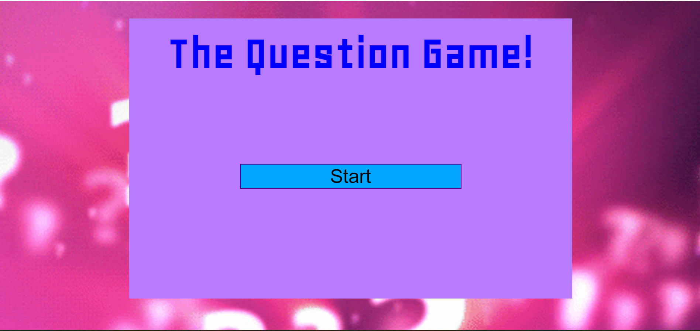
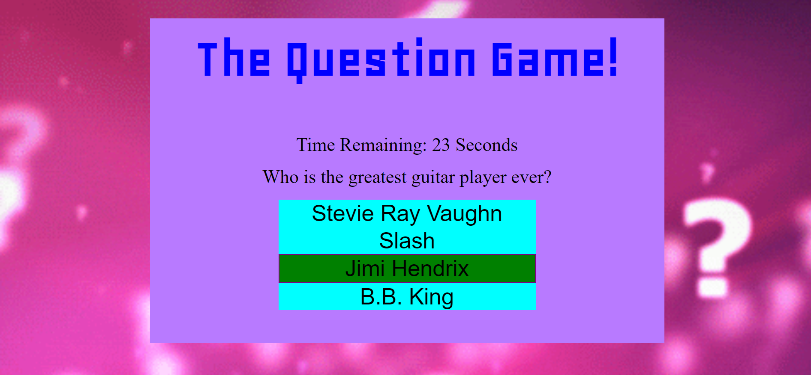
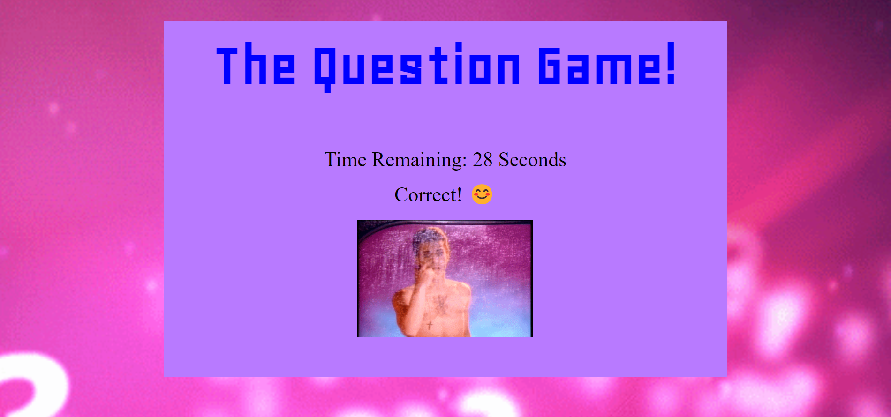

# QuestionsGame
In this application, the user has 25 seconds to answer 5 of each question after the user clicks begin.
If the user answers the questions correctly, the user wins the game. If the user answers any question incorrectly, the user will lose. For access to app click [here](https://ausar1989.github.io/MathTrivia/)

# Screenshots of The App
This is an image before the game begins:

This is an image after the game begins with 28 seconds remaining:

This is an image of the Done button being clicked:

# Technologies Used:
- HTML
- CSS
- Javascript
- jQuery
- Axios